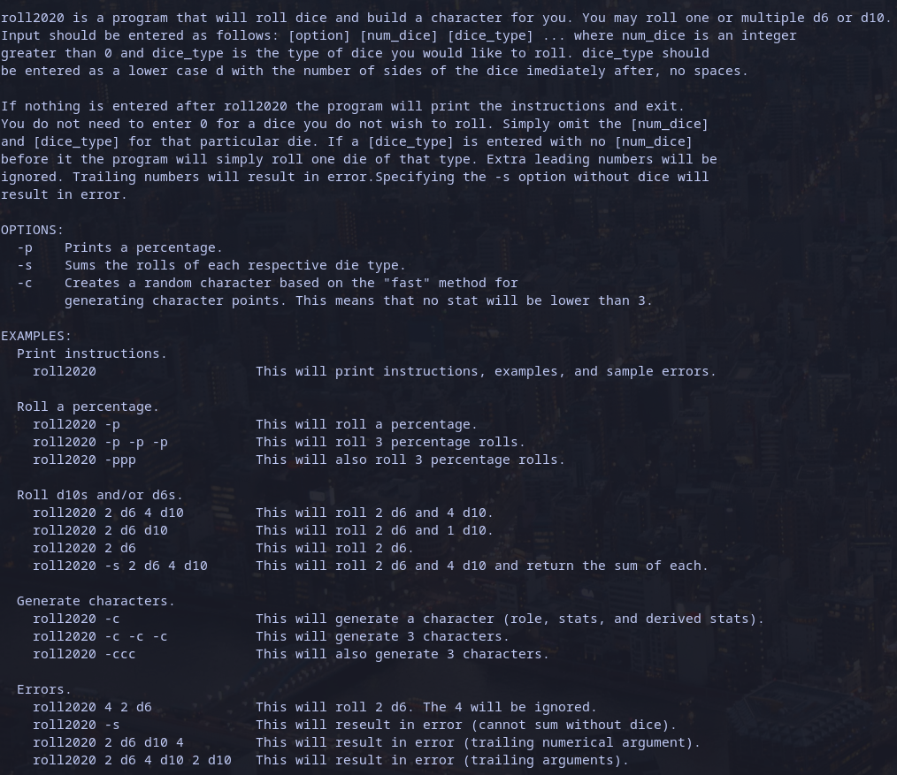

# Roll2020
## A Cyberpunk2020 oriented dice roller and character creator built for the command line
---
**Instructions**

---
**Dependencies**  
GCC  

With GCC installed:
- Clone the repository or download the ZIP. 
- Navigate to the directory where roll2020.c was downloaded.
- Run: gcc -o roll2020 main.c instructions.c dice.c charactergen.c -Wall -Werror
- After running the previous command an executable output file called roll2020 will be created.
- To run the executable file use: ./roll2020 with the desired options and arguments (on Windows: .\roll2020)
- Alternatively you can copy the output file to /bin or /usr/local/bin and run it like this: roll2020.

